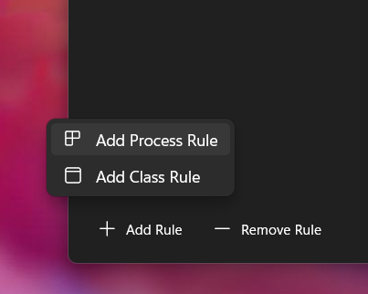
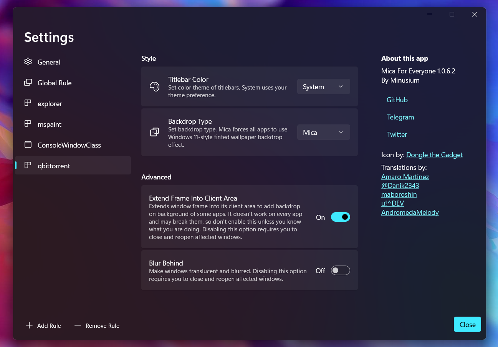
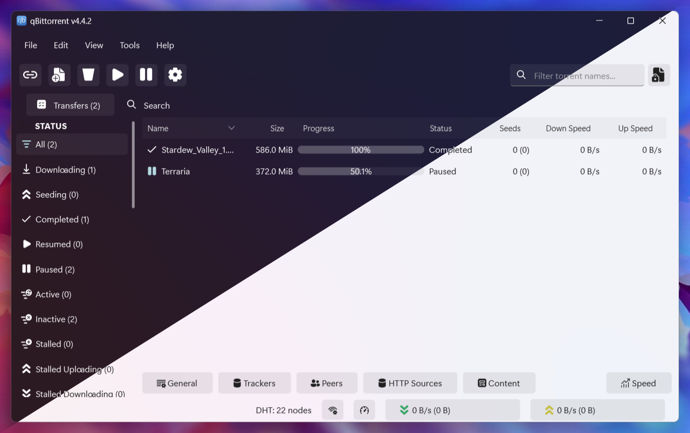

# Fluent theme for qBitTorrent
Fluent dark/light themes for qBitTorrent!  

## Requirements
- Windows 11 22H1 and above
- Mica For Everyone (optional)
- qBitTorrent on Qt5

## Download
Download theme [here](https://github.com/witalihirsch/qBitTorrent-fluent-theme/releases/) and download Mica for Everyone [here.](https://github.com/MicaForEveryone/MicaForEveryone/releases) 

## Using
If you want the theme to work correctly use these settings:

<b>Mica for Everyone settings</b>

  

  

  

## Screenshots

<b>Dark|Light Themes</b>

