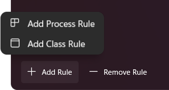
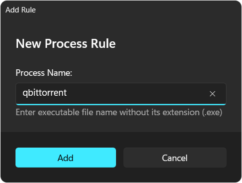
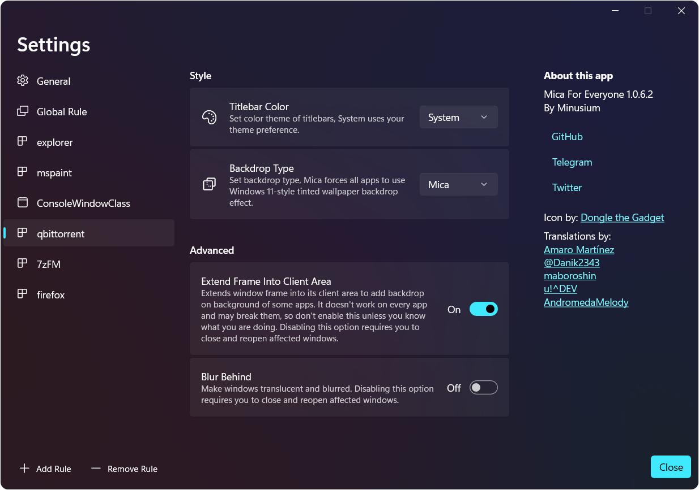
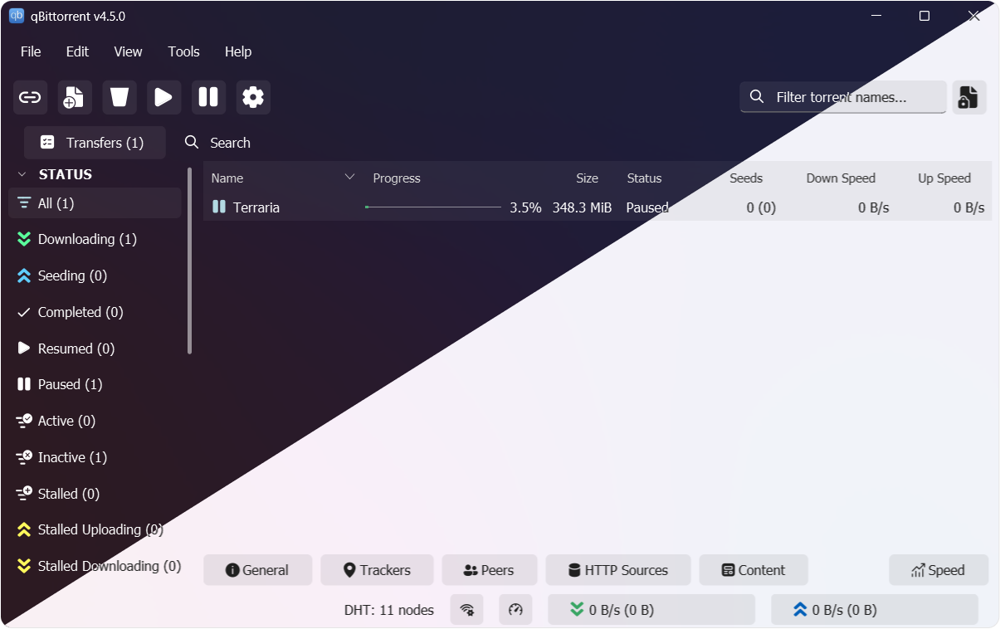
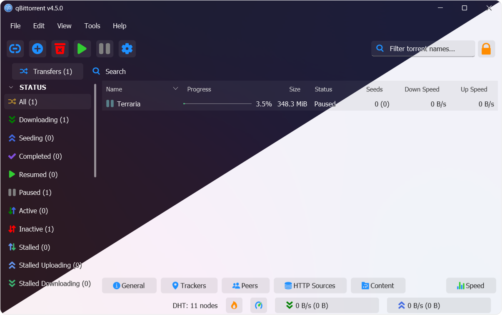

# Fluent theme for qBitTorrent
Fluent dark/light themes for qBitTorrent!  

## Support

    

## Requirements
- Windows 11 22H1 and above
- Mica For Everyone (optional, recommended version is `1.2.0.0`)
- qBitTorrent

## Download
Download theme [here](https://github.com/witalihirsch/qBitTorrent-fluent-theme/releases/) and download Mica for Everyone [here.](https://github.com/MicaForEveryone/MicaForEveryone/releases/) 

## Using
To install the theme, go to `Options` > `Behavior` > `Interface` and enable `Use custom UI Theme` and select the path to the theme file

If you want the theme to work correctly use these settings:

<b>Mica for Everyone settings</b>

  

  

  

##### Note: In case you find that MicaForEveryone app is making other unwanted changes to your PC's look and feel, simply go to all other rules listed and select Default in drop-down menu for all options given and toggle other options to Off.
##### In case mica themes act like normal themes after computer restarts, make sure to toggle on `Run on Startup` setting in `General` tab

## qBitTorrent Fluent Theme

<b>Dark|Light Themes with Fluent Icons</b>

<b>Dark|Light Themes with Default icons</b>

